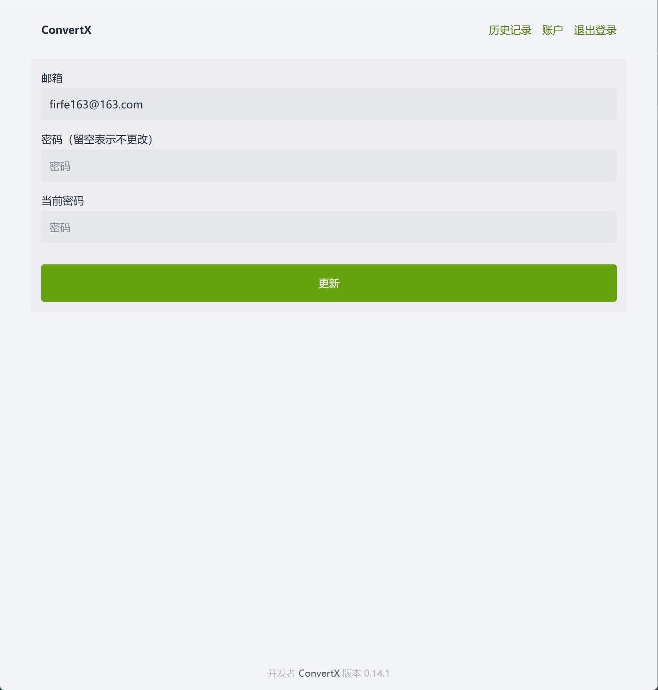
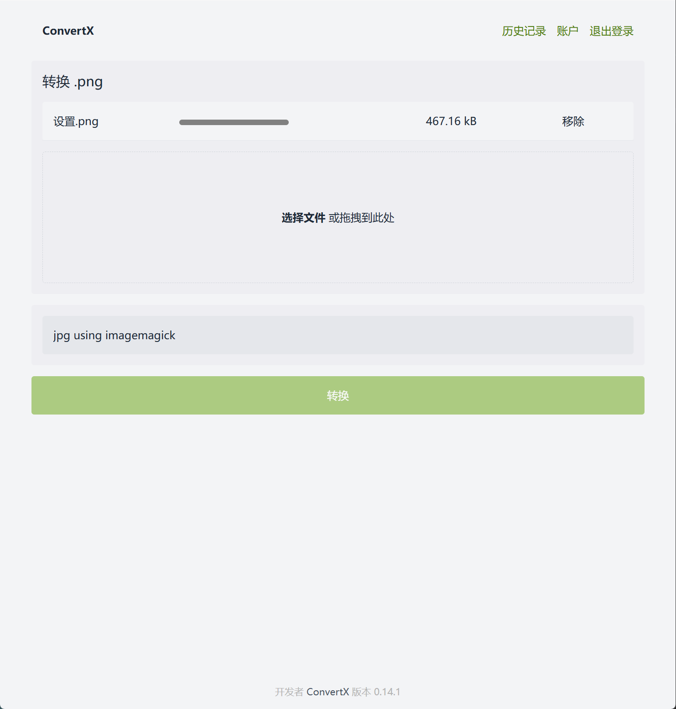
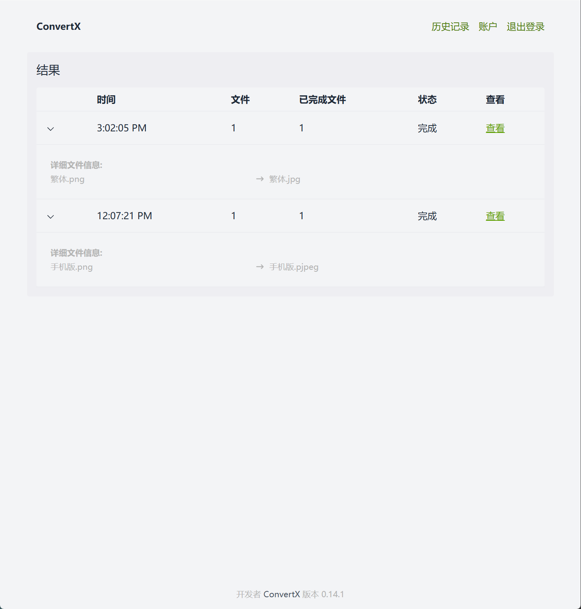
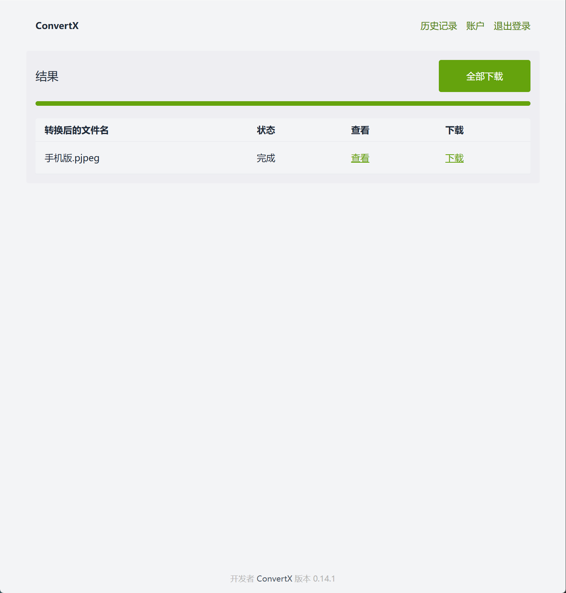

# convertx 格式转换

自托管的在线文件转换工具。

这是一个开源的在线文件格式转换工具，支持超过 1000 种主流文档、图片、音视频等多类型文件格式，不依赖第三方服务。它即装即用、操作便捷，并提供文件夹批量处理、实时进度条显示等功能。

- 原项目地址
  - GitHub仓库 https://github.com/C4illin/ConvertX
- 我汉化和构建docker镜像的仓库
  - GitHub仓库 https://github.com/Firfr/convertx-zh
  - Gitee仓库 https://gitee.com/firfe/convertx-zh

## 汉化&修改&镜像制作

当前制作镜像版本：0.15.1

感谢原作者的开源。  
原项目没有中文，我制作了中文docker镜像

具体汉化了那些内容，请参考[翻译说明](./翻译说明.md)。

只做了汉化和简单修改，有问题，请到原作者仓库处反馈。

欢迎关注我B站账号 [秦曱凧](https://space.bilibili.com/17547201) (读作 qín yuē zhēng)  

有需要帮忙部署这个项目的朋友,一杯奶茶,即可程远程帮你部署，需要可联系。  
微信号 `E-0_0-`  
闲鱼搜索用户 `明月人间`  
或者邮箱 `firfe163@163.com`  
如果这个项目有帮到你。欢迎start。

有其他的项目的汉化需求，欢迎提issue。或其他方式联系通知。

### 镜像

从阿里云或华为云镜像仓库拉取镜像，注意填写镜像标签，镜像仓库中没有`latest`标签

容器内部端口`3000`。

- 国内仓库
  - AMD64镜像
    ```bash
    swr.cn-north-4.myhuaweicloud.com/firfe/convertx-zh:0.15.1
    ```
- DockerHub仓库
  - AMD64镜像
    ```bash
    firfe/convertx-zh:0.15.1
    ```

### docker run 命令部署

```bash
docker run -d \
--name convertx-zh \
--network bridge \
--restart always \
--log-opt max-size=1m \
--log-opt max-file=1 \
-e HTTP_ALLOWED=true \
-e JWT_SECRET=c4illin_convertx \
-e LANGUAGE=zh \
-p 5148:3000 \
swr.cn-north-4.myhuaweicloud.com/firfe/convertx-zh:0.15.1
```
在命令最后追加`-p 端口`自定义端口

### compose 文件部署 👍推荐

```yaml
#version: '3'
name: convertx-zh
services:
  convertx-zh:
    container_name: convertx-zh
    image: swr.cn-north-4.myhuaweicloud.com/firfe/convertx-zh:0.15.1
    network_mode: bridge
    restart: always
    logging:
      options:
        max-size: 1m
        max-file: '1'
    environment:
      LANGUAGE: zh
      JWT_SECRET: c4illin_convertx
      HTTP_ALLOWED: true
      # 允许注册
      #ACCOUNT_REGISTRATION: true
    ports:
      - 5148:3000
    volumes:
      - ./data:/data
```

如果上面文件没有修改，启动成功后，访问`http://ip:5148`，注册一个管理员账号，然后登录，就可以使用了

### 效果截图

|  |  |
|-|-|
| |  |
